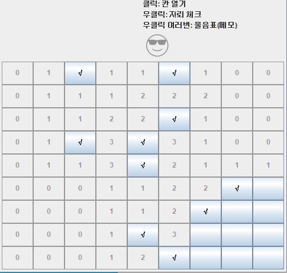
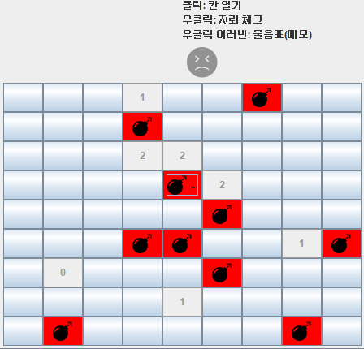
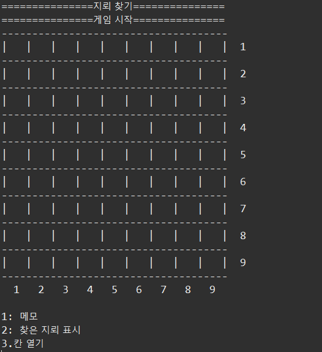
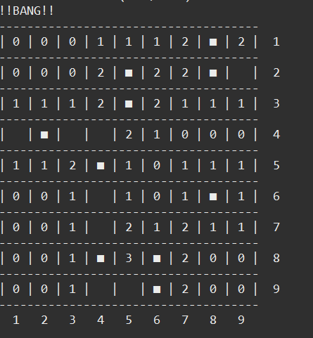

# Mine Game
고전적인 지뢰찾기 게임입니다.
***
### 1. 프로젝트 정보
  지뢰찾기 게임을 구현한 프로그램입니다.
  
  - 사용기술
    - JAVA 8

  - 특징
    - 9*9 크기의 셀에 지뢰 10개를 심어 초급 난이도의 지뢰찾기 게임 제공
    - 칸 열기, 지뢰 체크하기, 메모하기(물음표 마크 이용) 기능
    - 승리, 패배를 얼굴모양으로 구현
    - 콘솔, GUI, 두가지 버전으로 제공
 
- 제작기간
  - 2022.06.14 ~ 2022.06.25

- 담당업무와 기여도
  - 개인프로젝트라 전체를 제작함
  - 기여도: 100%

***

### 2. 프로그램 설치와 구동

JDK 혹은 JRE 설치가 선행되어야 합니다.   
  설치하러 가기 -> https://www.oracle.com/java/technologies/downloads/   
  
- GUI 구현 프로그램 실행  
  MainGame_start.jar 파일을 실행하세요.
  
- 콘솔 입출력 구현 프로그램 실행  
  MainGame 폴더 안의 Main클래스를 실행하세요.

***

### 3. 프로그램 미리보기
- GUI 구현   
   
   
- 콘솔 입출력구현    
    
     

***

### 4. LICENSE
- (C) 2022. JeonInha all rights reserved.
- 해당 프로그램에 사용된 디자인 요소들은 ShutterStock(https://www.shutterstock.com/ko/help) 에서 오픈소스 이미지를 사용하였습니다.

